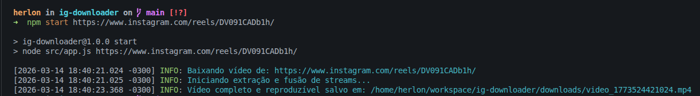

# IG Video Downloader CLI

Um utilitário de linha de comando (CLI) simples e prático para baixar vídeos do Instagram diretamente para a sua máquina.



## Estrutura do Projeto

A estrutura de diretórios do projeto é organizada da seguinte forma:

```text
ig-cli-video-downloader/
├── downloads/                  # Diretório gerado automaticamente onde os vídeos baixados são salvos
├── src/                        # Código-fonte da aplicação principal
│   ├── app.js                  # Ponto de entrada da aplicação via CLI
│   └── lib/                    # Módulos utilitários e lógica principal
│       ├── clear-downloads.js  # Script para apagar o conteúdo do diretório de downloads
│       └── downloader.js       # Lógica responsável por extrair e realizar os downloads do vídeo
│       └── logger.js           # Configuração do logger
├── package.json                # Configurações, dependências e scripts do projeto (Node.js)
└── README.md                   # Documentação do projeto
```

## Bibliotecas Utilizadas

O projeto faz uso das seguintes dependências principais e bibliotecas Node.js para o seu funcionamento:

- **[youtube-dl-exec](https://www.npmjs.com/package/youtube-dl-exec)**: Realiza o download dos vídeos usando o `yt-dlp`. Ele extrai e funde as streams de vídeo/áudio do Instagram em um arquivo com a melhor qualidade disponível (`bestvideo+bestaudio`).
- **[pino](https://www.npmjs.com/package/pino)** e **[pino-pretty](https://www.npmjs.com/package/pino-pretty)**: Utilizados para a geração de logs estruturados e formatados no terminal, substituindo o uso padrão do `console.log`.

## Como Clonar e Executar

Siga as instruções abaixo para configurar e utilizar a ferramenta no seu ambiente local:

### Pré-requisitos
Certifique-se de ter o **[Node.js](https://nodejs.org/)** instalado.

### Clonando o Repositório
Abra o seu terminal e clone o projeto através do link fornecido:
```bash
git clone https://github.com/herloncosta/ig-cli-video-downloader.git
cd ig-cli-video-downloader
```

### Instalando Dependências
Dentro da pasta do projeto, instale as bibliotecas necessárias:
```bash
npm install
```

### Baixando um Vídeo
Para iniciar o download de um vídeo do Instagram, basta executar o seguinte comando, passando a URL do vídeo/Reels como argumento:
```bash
npm start "https://www.instagram.com/reel/ID_DO_VIDEO/"
```
*(Você também pode utilizar `node src/app.js <URL>` diretamente).*

O utilitário processará o link e o arquivo `.mp4` gerado será salvo na pasta `downloads/` com um nome único temporal.

### Limpando Diretório
Foi criado também um script para limpar os vídeos antigos salvos na pasta local, você pode executá-lo a qualquer momento:
```bash
npm run clear
```
